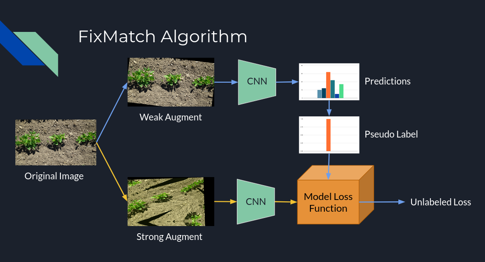

# RegenPGC SSL Segmentation Modeling
This Github Repository holds all of the training code needed for development of the groundcover detection, segmentation, and estimation modeling for the RegenPGC project.

## :bar_chart: Modeling Goals

There are currently over 3,500 images of perennial groundcover (PGC) species in a multitude of experimental plots and row cropping trials and studies. Our goal is to deveope a segmentation model to easily segment and classify the different portions of the images corresponding `soil`, `pgc_grass`, `weeds`, `crop_residue`, etc. Unfortunately, the main challenge of image annotation remains.
Masking out these images is time-consuming and requires technical knowledge of the system and great attention to minute details. This has been one of the largest hurdles in  development so far. 
Using a small DeepLabV3 model with a small MobileNet backbone encoder and 60 annotated images, we were able to quickly prototype a model that classified `pgc_grass`, `weeds`, and `soil` with decent accuracy though it was prone to overfitting due to class imbalances.
The images below show some of the test predictions for the three classes.

<figure>
    
    <figcaption>DeepLabV3 predictions for PGC grass.</figcaption>
</figure>

<figure>
    
    <figcaption>DeepLabV3 predictions for weeds.</figcaption>
</figure>

<figure>
    
    <figcaption>DeepLabV3 predictions for soil.</figcaption>
</figure>

However, these 60 images represent just a small amount of the total class diversity represented in the full image set, with many of the images posing significant segmentation challenges even for trained annotators. One way to overcome these data limitations is to drawn other sources of training data into the modeling scheme. There are three datasets that are suitable for this purpose. 
* First, the [Crop and Weed Dataset](https://github.com/cropandweed/cropandweed-dataset). This dataset has a wide range of crop species, weeds, grass and soil all presented in an overhead format similar to our images. There are several different dataset variants and 8034 images in total to work with. However, unlike our images which contain mostly plants and little soil, this datast contains a lot of soil while the plants are more sparsely distributed.
* Second, the [GrassClover Dataset](https://vision.eng.au.dk/grass-clover-dataset/). This dataset represents dense plots of grass and clover species growing together interspersed with different broadleaf weed species. The actual labeled dataset was constructed from 8000, synthetically generated images of clover, grass, weeds and soil and comes with both class target masks and class instance target masks. Additionally there are close to xxxxx full resolution images that were captured by and ATV mounted camera rig, an overhead NIKON camera mounted on a cart, and a static frame mounted Sony camera, to broaden the image diversity. These extra images, however, are unlabeled and so will be used later
* Finally, we have an internal dataset of around 1000 different kura clover species grown in isolated, weed free plots with quadrats. These images are fully annotated with masks for `clover`, `soil`, and the `quadrat` frame that they were imaged with.

Combining these datasets in a non-trivial fashion will require remapping many of the categories to simpler classes that represent our desired targets. For instance, while our project broadly categorized weeds in the `weed` category, the CropAndWeed Dataset is much more precise in identifying different species. These will have to be regrouped under one `weed` label for our purposes. Further, we are interested in categorizing the crop residue left in each plot, and while there is plenty of residue in the CropAndWeed images, it is all categorized as the background `soil` class. So this will need some rework.

Due to the overwhelming nature of the unlabeled dataset we have, we can leverage something called semi-supervised learning which sits between fully supervised and unsupervised training schemes. Without getting into the weeds on this, we can use the labeled data in combination with the unlabeled data to train a new model by iteratively predicting 'pseudo labels' for the unlabeled image set, discarding those labels that we are not confident about, and combining the labeled images loss with the unlabeled image loss in a weighted fashion. One common way to do this with images is by implementing the FixMatch algorithm shown below.

<figure>
    
    <figcaption>Flowchart of the main steps involved in the FixMatch SSL algorithm.</figcaption>
</figure>

# :computer: Environment Setup
Set up a `pyenv` virtual environment or whatever flavor of virtual environment you like
```
$ pyenv virtualenv <YOUR PYTHON VERSION HERE> <VIRTUALENV NAME>
$ pyenv local
```

# :arrow_double_down: Data Download

Several datasets need to be downloaded in order to train this model
Ensure that you have AWS Cli installed and configured. 
There is a shell script that will download all of the data for you and unpack it in your local directory.
From the root folder of the repo, make the download script executable
    ```
    $ chmod +x scripts/download_data.sh
    ```
Then call
    ```
    $ scripts/download_data.sh
    ```
This should download everything needed to train the model and unpack them into the right directories.
Even if you don't have the creds for AWS, you should still be able to get most of the datasets as it will check and download them directly from the source. This route takes longer though.

# :hammer_and_wrench: Data Preprocessing
Each of the datasets originally has very different mask structures. For instance, the grass clover dataset has `.png` images with the following categories and pixel values"
> 0. soil
> 1. clover
> 2. grass
> 3. weeds
> 4. white clover
> 5. red clover
> 6. dandelion
> 7. shepherds_purse
> 8. thistle
> 9. white_clover_flower
> 10. white_clover_leaf
> 11. red_clover_flower
> 12. red_clover_leaf
> 13. unknown_clover_leaf
> 14. unknown_clover_flower

This dataset is focused on identifying different parts of clover and distinguishing a few different weed species. But all we really care about for this dataset are the categories
> 0. soil
> 1. clover
> 2. grass
> 3. weeds

Since everything can be grouped up into these more general categories, we need to map the original labels such that 
> 0. soil = {soil}
> 1. clover = {clover, white clover, red clover, white_clover_leaf, white_clover_flower, red_clover_leaf, red_clover_flower, unknown_clover_leaf, unknown_clover_flower}
> 2. grass = {grass}
> 3. weeds = {weeds, dandelion, shepherd's purse, thistle}

Finally, these supercategories need to be mapped back to our pixel specification in `segmentation_labels.json`
> * soil -> soil = 0
> * clover -> pgc_clover = 3
> * grass -> pgc_grass = 2
> * weeds -> broadleaf_weed = 4

Thus for each image in the dataset, a new mask will need to be created which caputres all of these categories.

A similar mapping will need to be created for each dataset which has masks in different formats.

# To Do 
* Mapping script and functions for each dataset
    * Output is .png of shape (1, H, W) where H, W is the same as base image.
    * Mapped to correct classes
* Finish DataSets and DataLoaders for labeled and unlabeled datasets
    * Should I wrap all these in Lighting modules?
    * Make the length of each loader the same, easiest way to wrap them using '%%' ?
    * Set the batch size you want for each labeled and unlabled imageset and then set the _getitem_ method 
    * Custom Sampler or WeightedRandomResampler??
    * Lightning has some utilities like `from pl_bolts.utils.semi_supervised import balance_classes`
* Set up weighted loss criterion with `smp.losses`
    * args $\lambda$ and loss criterion
    * `total_loss = labeled_loss + lam * unlabeled_loss`
* Set up prediction and ground truth visualization functionalities
    * Overlay of target mask on orginal image
    * Overlay of prediction mask on original image
* Start to think about training the object detector?
    * K1702 dataset contains all of the quadrat images
    * Train a fast detector on that and use to predict UKY quadrat images as well as older kura clover image data from **venkat, schlautman, rife et al**
    * Train the marker detection model using the old images I took plus the new annotated ones and implement a ssl scheme
    * Run predictions over entire set of K1702, RegenPGC photos to get all annotations of markers and quadrat corners.